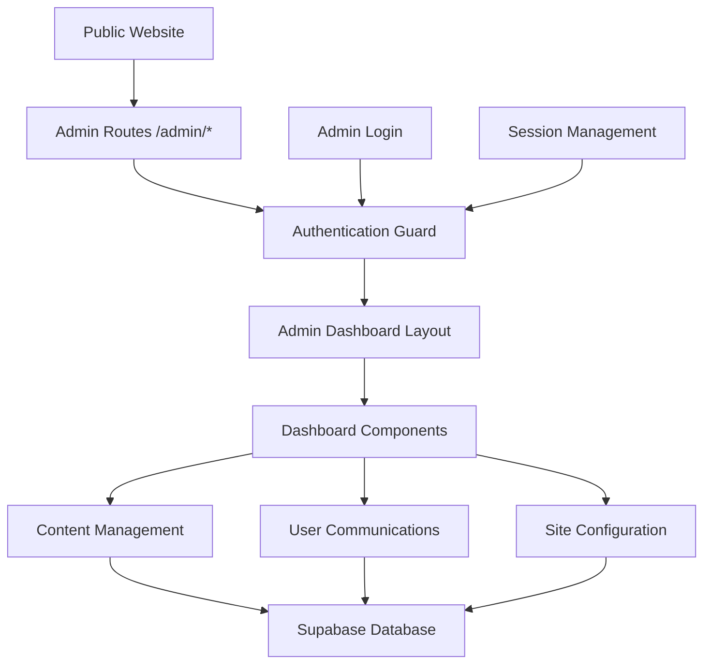
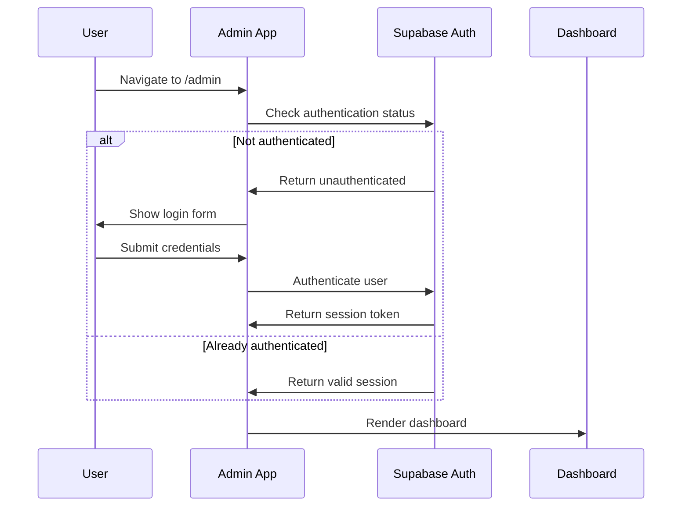

# Admin Dashboard Design Document

## Overview

The admin dashboard will be a comprehensive content management system built as a React-based single-page application that integrates seamlessly with the existing Octa Node Engineering website. The system will provide a secure, intuitive interface for managing all aspects of the website content, user communications, and site configuration.

The dashboard will follow a modern, clean design aesthetic consistent with the main website's visual language, utilizing the existing color scheme (#007bff primary blue) and typography (Poppins font family). The interface will be fully responsive and optimized for both desktop and mobile administration.

## Architecture

### High-Level Architecture



### Component Architecture

The admin system will be structured as a separate module within the existing React application:

- **Admin Router**: Handles all `/admin/*` routes with authentication guards
- **Admin Layout**: Provides consistent navigation and layout for all admin pages
- **Feature Modules**: Organized by functionality (Products, Blog, Messages, etc.)
- **Shared Components**: Reusable UI components specific to admin functionality
- **Services**: API communication layer with Supabase
- **Context/State**: Global admin state management using React Context

### Authentication Flow



## Components and Interfaces

### 1. Authentication System

#### Login Component
- **Purpose**: Secure admin authentication
- **Features**:
  - Email/password login form
  - "Remember me" functionality
  - Password reset capability
  - Loading states and error handling
  - Branding consistent with main site

#### Authentication Guard
- **Purpose**: Protect admin routes from unauthorized access
- **Features**:
  - Route-level protection
  - Automatic redirect to login
  - Session validation
  - Role-based access control (future extensibility)

### 2. Dashboard Layout

#### Admin Navigation Sidebar
- **Purpose**: Primary navigation for admin functions
- **Features**:
  - Collapsible sidebar design
  - Icon-based navigation with labels
  - Active state indicators
  - User profile section with logout
  - Responsive mobile navigation

#### Admin Header
- **Purpose**: Top navigation and user controls
- **Features**:
  - Site logo/branding
  - Breadcrumb navigation
  - User avatar and dropdown menu
  - Quick actions (notifications, settings)
  - Mobile menu toggle

### 3. Dashboard Overview

#### Analytics Cards
- **Purpose**: Quick overview of site metrics
- **Features**:
  - Total products count
  - Unread messages count
  - Newsletter subscribers count
  - Recent activity feed
  - Visual charts/graphs

### 4. Product Management

#### Product List View
- **Purpose**: Display and manage all products
- **Features**:
  - Searchable/filterable product table
  - Bulk actions (delete, status change)
  - Quick edit capabilities
  - Pagination for large datasets
  - Product status indicators

#### Product Editor
- **Purpose**: Create and edit product information
- **Features**:
  - Rich text editor for descriptions
  - Multiple image upload with drag-and-drop
  - Image reordering and management
  - SEO fields (meta title, description)
  - Product categorization
  - Preview functionality

### 5. Blog Management

#### Blog Post List
- **Purpose**: Manage all blog content
- **Features**:
  - Draft/published status management
  - Search and filtering
  - Bulk operations
  - Publication scheduling
  - Author management

#### Blog Editor
- **Purpose**: Create and edit blog posts
- **Features**:
  - WYSIWYG rich text editor
  - Image insertion and management
  - SEO optimization fields
  - Tags and categories
  - Preview mode
  - Auto-save functionality

### 6. Communication Management

#### Messages Dashboard
- **Purpose**: View and respond to contact form submissions
- **Features**:
  - Inbox-style message list
  - Read/unread status indicators
  - Message threading/conversations
  - Response templates
  - Message archiving
  - Export functionality

#### Newsletter Management
- **Purpose**: Manage newsletter subscribers
- **Features**:
  - Subscriber list with search/filter
  - Subscription status management
  - Export subscriber data
  - Unsubscribe management
  - Subscriber analytics

### 7. Site Configuration

#### Contact Information Manager
- **Purpose**: Update site contact details
- **Features**:
  - Form-based editing of contact info
  - Real-time preview of changes
  - Validation for required fields
  - Multiple contact methods support

#### Social Media Manager
- **Purpose**: Manage social media links and handles
- **Features**:
  - Platform-specific input fields
  - URL validation
  - Icon preview
  - Add/remove social platforms
  - Link testing functionality

#### Carousel Manager
- **Purpose**: Manage hero section carousel images
- **Features**:
  - Image upload with preview
  - Drag-and-drop reordering
  - Caption editing
  - Image optimization
  - Responsive preview

#### Flash Card Manager
- **Purpose**: Control promotional flash cards
- **Features**:
  - Flash card content editor
  - Activation/deactivation controls
  - Scheduling functionality
  - Preview mode
  - Multiple flash card support

### 8. Notification System

#### Notification Center
- **Purpose**: Send notifications to users
- **Features**:
  - Rich text notification composer
  - User targeting options
  - Scheduling capabilities
  - Delivery tracking
  - Template management

## Data Models

### User Authentication
```typescript
interface AdminUser {
  id: string;
  email: string;
  role: 'admin' | 'super_admin';
  created_at: string;
  last_login: string;
  is_active: boolean;
}
```

### Product Management
```typescript
interface Product {
  id: string;
  name: string;
  description: string;
  full_description: string;
  category: string;
  images: ProductImage[];
  features: string[];
  benefits: string[];
  tech_specs: Record<string, any>;
  status: 'draft' | 'published' | 'archived';
  created_at: string;
  updated_at: string;
}

interface ProductImage {
  id: string;
  url: string;
  alt_text: string;
  order: number;
}
```

### Blog Management
```typescript
interface BlogPost {
  id: string;
  title: string;
  slug: string;
  content: string;
  excerpt: string;
  featured_image: string;
  author_id: string;
  status: 'draft' | 'published' | 'scheduled';
  published_at: string | null;
  created_at: string;
  updated_at: string;
  tags: string[];
  meta_title: string;
  meta_description: string;
}
```

### Communication
```typescript
interface ContactMessage {
  id: string;
  name: string;
  email: string;
  phone?: string;
  company?: string;
  subject: string;
  message: string;
  status: 'unread' | 'read' | 'replied' | 'archived';
  created_at: string;
  replied_at?: string;
  reply_content?: string;
}

interface NewsletterSubscriber {
  id: string;
  email: string;
  status: 'active' | 'unsubscribed';
  subscribed_at: string;
  unsubscribed_at?: string;
  source: string;
}
```

### Site Configuration
```typescript
interface SiteConfig {
  id: string;
  key: string;
  value: any;
  updated_at: string;
}

interface CarouselImage {
  id: string;
  url: string;
  alt_text: string;
  caption?: string;
  order: number;
  is_active: boolean;
}

interface FlashCard {
  id: string;
  title: string;
  content: string;
  type: 'info' | 'warning' | 'success' | 'error';
  is_active: boolean;
  start_date?: string;
  end_date?: string;
  created_at: string;
}
```

## Error Handling

### Client-Side Error Handling
- **Form Validation**: Real-time validation with user-friendly error messages
- **API Error Handling**: Graceful handling of network errors with retry mechanisms
- **Authentication Errors**: Clear messaging for expired sessions or invalid credentials
- **File Upload Errors**: Specific error messages for file size, type, or upload failures

### Error Boundaries
- **Component-Level**: Isolated error boundaries for each major feature
- **Global Error Boundary**: Catch-all for unexpected errors with reporting
- **Fallback UI**: User-friendly error pages with recovery options

### Logging and Monitoring
- **Error Tracking**: Integration with error monitoring service
- **User Action Logging**: Track admin actions for audit purposes
- **Performance Monitoring**: Monitor admin dashboard performance

## Testing Strategy

### Unit Testing
- **Component Testing**: Test individual React components with React Testing Library
- **Service Testing**: Test API service functions and data transformations
- **Utility Testing**: Test helper functions and utilities
- **Hook Testing**: Test custom React hooks

### Integration Testing
- **API Integration**: Test communication with Supabase backend
- **Authentication Flow**: Test complete login/logout workflows
- **Form Submissions**: Test end-to-end form submission processes
- **File Upload**: Test image upload and processing workflows

### End-to-End Testing
- **User Workflows**: Test complete admin user journeys
- **Cross-Browser Testing**: Ensure compatibility across browsers
- **Mobile Responsiveness**: Test admin interface on mobile devices
- **Performance Testing**: Test dashboard performance under load

### Security Testing
- **Authentication Testing**: Verify secure authentication implementation
- **Authorization Testing**: Test role-based access controls
- **Input Validation**: Test for XSS and injection vulnerabilities
- **Session Management**: Test session security and timeout handling

## UI/UX Design Principles

### Design System
- **Color Palette**: Consistent with main site (#007bff primary, complementary colors)
- **Typography**: Poppins font family for consistency
- **Spacing**: 8px grid system for consistent spacing
- **Components**: Reusable component library for admin interface

### Accessibility
- **WCAG 2.1 AA Compliance**: Meet accessibility standards
- **Keyboard Navigation**: Full keyboard accessibility
- **Screen Reader Support**: Proper ARIA labels and semantic HTML
- **Color Contrast**: Ensure sufficient contrast ratios

### Responsive Design
- **Mobile-First**: Design for mobile devices first
- **Breakpoints**: Consistent breakpoints with main site
- **Touch Targets**: Appropriate touch target sizes for mobile
- **Navigation**: Collapsible navigation for smaller screens

### User Experience
- **Intuitive Navigation**: Clear information architecture
- **Feedback**: Immediate feedback for user actions
- **Loading States**: Clear loading indicators for async operations
- **Progressive Disclosure**: Show information progressively to avoid overwhelm